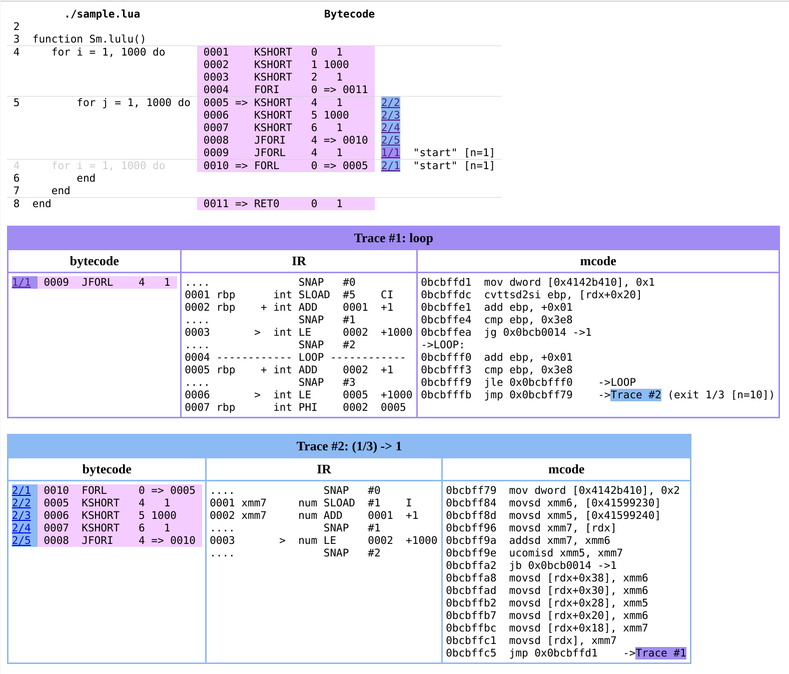

LOOM
====

It's a replacement / enhancement of the `-jdump` option included in LuaJIT.

As a command line argument
===

Just put it in a `jit/` directory within `package.path` or `$LUA_PATH`, typically `'/usr/local/share/luajit-2.1..../jit/'`; but it also works in `'/usr/local/share/lua/5.1/jit/'` or even `'./jit/'`.  Then it can be used as an argument to LuaJIT in the form:

**`-jloom[=<tmpl>[,<out>]]`**

`<tmpl>` is a template file (default `'loom.html'`) and `<out>` is an output file name (default `io.stdout`).

Lua API
===

If you want to report traces on just part of your code, it's better to use it explicitly.

**`local loom = require 'jit.loom'`**

As any module, you have to `require()` it first.

**`loom.on()`**

Starts recording all JIT events and traces.

**`traces, funcs = loom.off()`**

**`report = loom.off([f [, ...]])`**

Stops recording and performs any processing and cross references needed to actually generate a report.

Called without any arguments, returns two Lua tables, one with the processed trace information and a second one with all the functions involved in those traces execution.

The second form is equivalent to

    do
        local traces, funcs = loom.off()
        report = f(traces, funcs, ...)
    end

That is, both return values (the `traces` and `funcs` arrays) are passed to the given function `f`, together with any extra argument, and returns any return value(s) of `f`.

**`loom.start(tmpl, out)`**

Implements the `-jloom[=tmpl[,out]]` option. The `tmpl` argument is passed to `loom.template()` to create a reporting function.  If omitted, defaults to `'loom.html'`.  The `out` parameter is either a writeable open file or a file name where the report is written into (after formatting by the template), defaults to `io.stdout`.  When the Lua VM is terminated normally, `loom.off()` is called with the reporting function created by the given template.,

### Utility Functions

There are some functions included in the `loom` package to help formatting a report.

**`f = loom.template(tmpl)`**

The string `tmpl` is a report template using the template syntax described below.  If it doesn't contain any line break, is interpreted as a pathname to read the template from a text file.

The template is compiled into a Lua function that takes some arguments (named with `{{@ name ...}}` tags) and outputs the result as a string.

**`loom.annotated(funcs, traces)`**

Returns an annotated listing of the source code of the given `funcs` and `traces` arrays.

**`loom.allipairs(t)`**

Like `ipairs(t)`, but stops at `table.maxn(t)` instead of the first `nil` value.

**`loom.sortedpairs(t)`**

Returns an iterator that visits the same pairs as `pairs(t)`, but sorted by keys.

Template syntax
===

The included template implementation is based on Danila Poyarkov's [lua-template](https://github.com/dannote/lua-template), with a syntax more like Django's or Handlebar's, to make it more friendly to editors that help with HTML content.

**``**

Embeds any Lua code

**`{{ expression }}`**

Outputs the result of the Lua expression, with the `&`, `"`, `<` and `>` characters escaped.

**`{{= expression }}`**

Outputs the result of the Lua expression verbatim, without any character escaping.

**`{{: 'fmt', args, ... }}`**

Outputs the result of `string.format(fmt, args, ...)` without any escaping.

**`{@ name ... }`**

Defines template argument names.  Each `name` must be a valid Lua variable name (that is, a sequence of letters, numbers or underscores not beginning with a number), separated by commas or spaces (or any non-alfanumeric-underscore character).

Included Template
===

The included `loom.html` template renders the trace report as an HTML document.  It's divided in two sections: a Sourcecode -> Bytecode -> Traces one, and a list of traces, with the Bytecode -> IR -> mcode progression for each one.

1.- Source list
---

For each function that appears in the traces, the source code is shown on the left column (if the source was in a file) and the bytecode at right of it with a random background color (a different one for each function).

The bytecode is shown in the order it appears in memory, so some source lines are in a different order as in the original source or repeated, for example the opening of a `for` loop appears again (in a lighter gray) in the bottom of the loop.

At the right of the bytecode, there are links of the form `<tr>/<seq>`, showing some trace executed it at some sequential number.  For example `3/4` means it's the fourth bytecode executed by trace #3.  A single bytecode can appear several times in the same trace (for example, when unrolling a loop).  Each trace have assigned a random background color.

Trace start and abort events are also marked to the right of the relevant bytecode, with `[n=xx]` notes telling how many times they happened until the trace gets compiled or blacklisted.

2.- Trace list
---

Each trace gets a three-column table framed on the same color as the respective links in the previous section.

The first column lists the bytecode in the order it was executed.  On the left there are links that go back to the same bytecode on the previous section.  The bytecodes keep the same background colour of the function.  Clicking on the column title toggles source code annotations.

The second column lists the IR code generated by the trace.  While the total semantics is supposed to be maintained, there's no direct correspondence between IR and bytecode instructions.  For example, as much code as possible is moved before the start of an inner loop, and compilable library functions are just checked (to assure they're the right functions) and IR code is emitted instead of a call to the function.

Snapshot points are inserted in the IR code, but the snapshot content isn't shown by default.  To see them, either hover the mouse over the snapshot or click in the column title to reveal all at the same time.

The third column is the generated mcode that is natively executed by the processor.  Exit points are labelled by the snapshot number or a trace number if a later trace patched itself in.

Examples
===

The 'sample.lua' file includes some small code snippets to play with.  For example, the comments about `-jv` option show:

    luajit -jv -e "for i=1,1000 do for j=1,1000 do end end"

To output just two lines (one per trace).  Changing to `-jdump` results in:

    ---- TRACE 1 start (command line):1
    0009  FORL     4 => 0009
    ---- TRACE 1 IR
    0001    int SLOAD  #5    CI
    0002  + int ADD    0001  +1
    0003 >  int LE     0002  +1000
    0004 ------ LOOP ------------
    0005  + int ADD    0002  +1
    0006 >  int LE     0005  +1000
    0007    int PHI    0002  0005
    ---- TRACE 1 mcode 47
    0bcbffd1  mov dword [0x41a94410], 0x1
    0bcbffdc  cvttsd2si ebp, [rdx+0x20]
    0bcbffe1  add ebp, +0x01
    0bcbffe4  cmp ebp, 0x3e8
    0bcbffea  jg 0x0bcb0014	->1
    ->LOOP:
    0bcbfff0  add ebp, +0x01
    0bcbfff3  cmp ebp, 0x3e8
    0bcbfff9  jle 0x0bcbfff0	->LOOP
    0bcbfffb  jmp 0x0bcb001c	->3
    ---- TRACE 1 stop -> loop

    ---- TRACE 2 start 1/3 (command line):1
    0010  FORL     0 => 0005
    0005  KSHORT   4   1
    0006  KSHORT   5 1000
    0007  KSHORT   6   1
    0008  JFORI    4 => 0010
    ---- TRACE 2 IR
    0001    num SLOAD  #1    I
    0002    num ADD    0001  +1
    0003 >  num LE     0002  +1000
    ---- TRACE 2 mcode 81
    0bcbff79  mov dword [0x41a94410], 0x2
    0bcbff84  movsd xmm6, [0x403382b8]
    0bcbff8d  movsd xmm5, [0x403382c8]
    0bcbff96  movsd xmm7, [rdx]
    0bcbff9a  addsd xmm7, xmm6
    0bcbff9e  ucomisd xmm5, xmm7
    0bcbffa2  jb 0x0bcb0014	->1
    0bcbffa8  movsd [rdx+0x38], xmm6
    0bcbffad  movsd [rdx+0x30], xmm6
    0bcbffb2  movsd [rdx+0x28], xmm5
    0bcbffb7  movsd [rdx+0x20], xmm6
    0bcbffbc  movsd [rdx+0x18], xmm7
    0bcbffc1  movsd [rdx], xmm7
    0bcbffc5  jmp 0x0bcbffd1
    ---- TRACE 2 stop -> 1

To recreate under loom, try:

    luajit -jloom -e "require('sample').lulu()" > out.html

And open the resulting `out.html` with a browser to see the same thing with nice colours and links to help following how the traces flow together.

